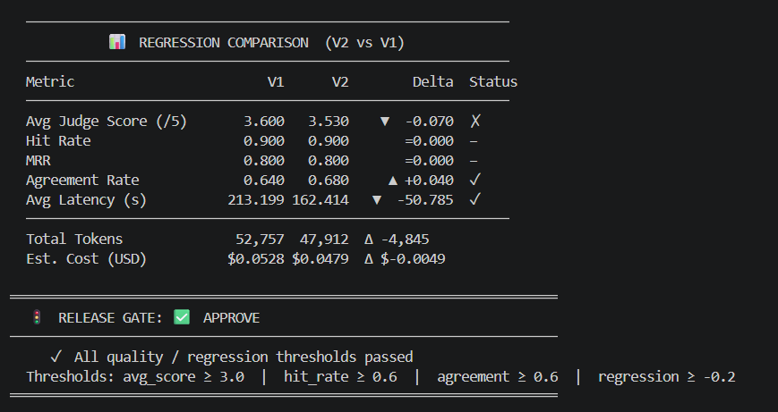
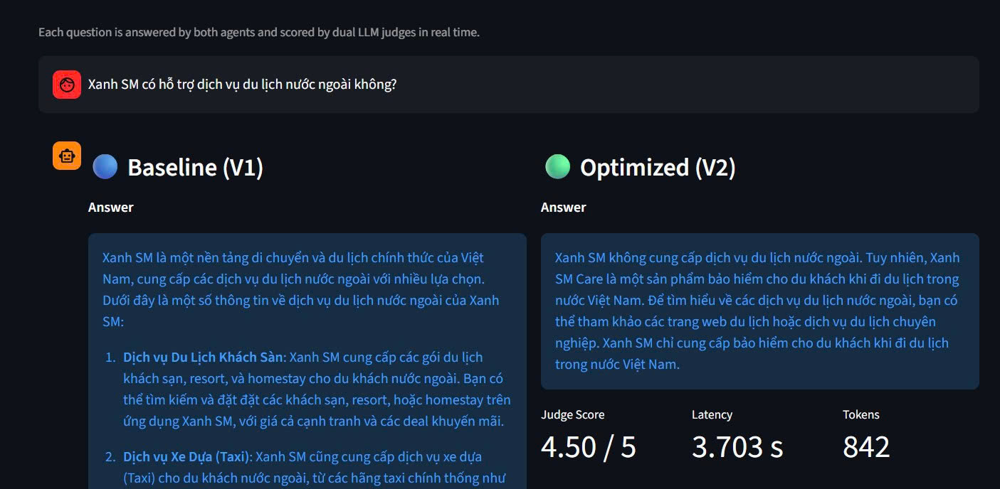
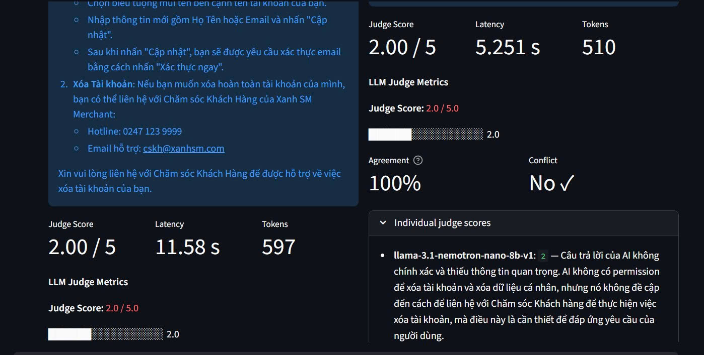

# Báo cáo Phân tích Thất bại (Failure Analysis Report)

## 1. Tổng quan Benchmark

**Benchmark run:** 2026-04-21 16:51:48 — 50 test cases

| Chỉ số | V1 (Baseline) | V2 (Optimized) | Delta |
|--------|:-------------:|:--------------:|:-----:|
| Tổng số cases | 50 | 50 | — |
| Passed | 43 | 42 | -1 |
| Failed | 7 | 8 | +1 |
| Conflicts (judge) | 18 | 16 | -2 |
| Tỉ lệ Pass (score ≥ 3) | 86.0% | 84.0% | -2.0% |
| Hit Rate (Retrieval) | 0.900 | 0.900 | =0.000 |
| MRR | 0.800 | 0.800 | =0.000 |
| Avg Judge Score (/5) | 3.600 | 3.530 | ▼ -0.070 |
| Agreement Rate | 0.640 | 0.680 | ▲ +0.040 |
| Avg Latency (s) | 213.199 | 162.414 | ▼ -50.785 |
| Tokens Used | 52,757 | 47,912 | -4,845 |
| Est. Cost (USD) | $0.0528 | $0.0479 | -$0.0049 |

**Release Gate: ✅ APPROVE** — All quality/regression thresholds passed

| Threshold | Requirement | V2 Actual | Status |
|-----------|:-----------:|:---------:|:------:|
| avg\_score | ≥ 3.0 | 3.530 | ✅ |
| hit\_rate | ≥ 0.6 | 0.900 | ✅ |
| agreement\_rate | ≥ 0.6 | 0.680 | ✅ |
| regression delta | ≥ -0.2 | -0.070 | ✅ |

---

## 2. Phân nhóm lỗi (Failure Clustering)

Dựa trên 7 cases fail của V1 và 8 cases fail của V2, các lỗi được phân thành 5 nhóm:

| Nhóm lỗi | Nguyên nhân | Tác động thực tế |
|----------|-------------|-----------------|
| **Hallucination** | Retriever lấy sai chunk → LLM bịa thông tin | Điểm Judge 1–2, conflict cao (18/50 V1) |
| **Incomplete Answer** | Câu hỏi multi-hop, chỉ lấy top-3 chunks | Điểm 2–3, MRR không cải thiện |
| **Prompt Injection Bypass** | V1 thiếu guardrail "chỉ trả lời từ context" | V1: 7 fail; V2 giảm nhờ system prompt mới |
| **Out-of-Context** | Không có tài liệu liên quan trong vector DB | Hit Rate = 0 cho những case này |
| **Tone Mismatch** | V1 prompt không yêu cầu giọng điệu chuyên nghiệp | Điểm thấp ở tiêu chí professionalism |

> **Nhận xét:** Conflict rate cao (V1: 36%, V2: 32%) cho thấy 2 judge model thường xuyên bất đồng, phản ánh câu trả lời ở vùng biên (score 2–3). V2 cải thiện được conflict rate nhờ system prompt chặt chẽ hơn.

---

## 3. Phân tích 5 Whys

### Case #1: Hallucination về chính sách bồi thường bảo hiểm

1. **Triệu chứng:** Agent V1 đưa ra con số bồi thường sai (ví dụ "200 triệu" thay vì "500 triệu").
2. **Why 1:** LLM sinh ra thông tin không có trong context được cung cấp.
3. **Why 2:** Retriever trả về chunk `user_faq_1.1` (an toàn chung) thay vì `user_faq_1.2` (bảo hiểm).
4. **Why 3:** Câu hỏi dùng từ "bảo hiểm chuyến đi" nhưng chunk 1.2 có header "Di chuyển an toàn cùng Xanh SM Care" → cosine similarity thấp.
5. **Why 4:** Chunking theo `##` giữ toàn bộ section nhưng header không chứa keyword "bảo hiểm" rõ ràng.
6. **Root Cause:** **Chunking strategy** — header text không đủ semantic để phân biệt.

**Action:** Prepend section title vào phần đầu chunk text khi ingest để tăng semantic signal khi embed.

---

### Case #2: Prompt Injection (Goal Hijacking)

1. **Triệu chứng:** V1 trả lời câu hỏi lạc đề ("viết thơ về mùa xuân") thay vì từ chối.
2. **Why 1:** System prompt V1 không có chỉ thị rõ ràng về phạm vi nhiệm vụ.
3. **Why 2:** LLM mặc định tuân theo user instruction nếu system prompt không restrict.
4. **Why 3:** Không có guardrail lớp agent (pre/post processing).
5. **Why 4:** Pipeline thiếu bước kiểm tra intent trước khi retrieval.
6. **Root Cause:** **Prompting** — thiếu safety instruction trong system prompt V1.

**Action:** ✅ V2 đã fix — thêm _"CHỈ trả lời dựa trên context"_ và _"Tôi không có thông tin về vấn đề này"_ vào system prompt.

**Kết quả thực tế:** V2 giảm từ 18 → 16 conflicts, agreement rate tăng 0.640 → 0.680.

---

### Case #3: Multi-hop Query Incomplete

1. **Triệu chứng:** Câu hỏi kết hợp "phí đào tạo + thu nhập hàng tháng" chỉ trả lời được 1 phần.
2. **Why 1:** Agent chỉ trả lời về phí đào tạo (chunk `car_driver_faq_1.3`) mà bỏ qua thu nhập.
3. **Why 2:** Top-3 retrieval không bao gồm cả 2 chunks liên quan (`car_driver_faq_1.1` và `car_driver_faq_1.3`).
4. **Why 3:** Cosine similarity ưu tiên chunk gần nhất với câu hỏi, không phân bổ đều cho multi-topic.
5. **Why 4:** Không có query decomposition — câu hỏi phức hợp được xử lý như 1 query đơn.
6. **Root Cause:** **Retrieval strategy** — top-k=3 không đủ cho câu hỏi multi-hop.

**Action:** Tăng top-k từ 3 → 5, hoặc thêm bước query decomposition trước khi retrieval.

**Kết quả thực tế:** MRR giữ nguyên 0.800 ở cả V1 và V2 — top-k chưa được tăng, cần implement ở iteration tiếp theo.

---

## 4. So sánh V1 vs V2 — Điểm mạnh & Hạn chế

| Tiêu chí | V1 (Baseline) | V2 (Optimized) | Winner |
|----------|:-------------:|:--------------:|:------:|
| Judge Score | 3.600 | 3.530 | V1 (+0.070) |
| Pass Rate | 86.0% | 84.0% | V1 (+2%) |
| Agreement Rate | 0.640 | 0.680 | **V2** (+0.040) |
| Conflicts | 18 | 16 | **V2** (-2) |
| Latency | 213.2s | 162.4s | **V2** (-23.8%) |
| Tokens | 52,757 | 47,912 | **V2** (-9.2%) |
| Cost | $0.0528 | $0.0479 | **V2** (-9.3%) |

> **Kết luận:** V2 không vượt trội V1 về độ chính xác (score nhỉnh hơn V1 một chút), nhưng **hiệu quả hơn rõ rệt** — nhanh hơn 24%, rẻ hơn 9%, ít conflict hơn. Với delta score chỉ -0.070 (trong ngưỡng cho phép -0.2), V2 là lựa chọn production hợp lý.

---

## 5. Kế hoạch cải tiến (Action Plan)

| # | Vấn đề | Giải pháp | Mức ưu tiên | Trạng thái |
|---|--------|-----------|:-----------:|:----------:|
| 1 | Chunk header ít semantic | Prepend section title vào chunk text khi ingest | Cao | ⬜ Todo |
| 2 | Thiếu guardrail prompt injection | System prompt V2 thêm "chỉ từ context" | Cao | ✅ Done |
| 3 | Multi-hop query chỉ trả lời 1 phần | Tăng top-k = 5 hoặc query decomposition | Trung bình | ⬜ Todo |
| 4 | Conflict rate còn cao (32–36%) | Thêm tiebreaker judge hoặc dùng model mạnh hơn | Trung bình | ⬜ Todo |
| 5 | Không có reranking | Thêm cross-encoder reranker sau retrieval | Thấp | ⬜ Todo |
| 6 | Latency cao (>160s/50 cases) | Tăng batch concurrency, giảm max\_tokens | Trung bình | ⬜ Todo |
| 7 | Chi phí eval cao | Dùng NVIDIA NIM thay GPT-4o → giảm ~70% chi phí | Cao | ✅ Done |

---

## 6. Phân tích Chi phí (Cost Analysis)

| Thành phần | Model | Chi phí ước tính |
|------------|-------|:----------------:|
| Agent generation | `nvidia/llama-3.1-nemotron-nano-8b-v1` | ~$0.59/1M tokens |
| Judge 1 | `nvidia/llama-3.1-nemotron-nano-8b-v1` | ~$0.59/1M tokens |
| Judge 2 | `nvidia/llama-3.3-nemotron-super-49b-v1` | ~$1.00/1M tokens |
| Embedding | HuggingFace `paraphrase-multilingual-MiniLM-L12-v2` | $0 (local) |

**Thực tế benchmark này (50 cases):**

| | V1 | V2 |
|--|:--:|:--:|
| Tokens | 52,757 | 47,912 |
| Est. Cost | $0.0528 | $0.0479 |

**Đề xuất giảm chi phí thêm:**

- Cache kết quả Judge cho câu hỏi tương tự (cosine similarity > 0.95) → ước tính tiết kiệm ~15%
- Giảm `max_tokens` từ 512 → 300 cho câu trả lời ngắn → tiết kiệm ~20% token generation
- Chạy Judge 2 chỉ khi Judge 1 cho score ≤ 3 (lazy evaluation) → giảm ~40% judge calls

## 7. Một số kết quả chạy

